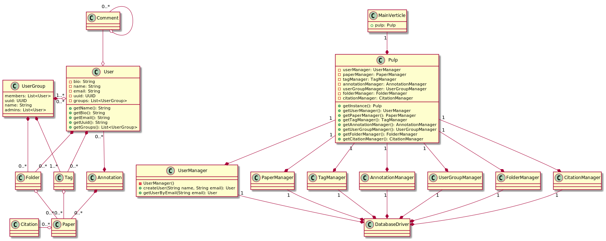
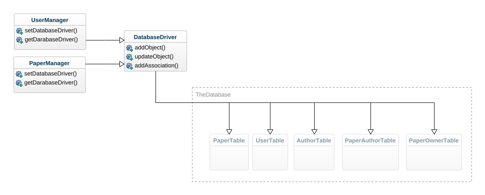

# Project Inception

Group 02 - "Pulp"

Date: 2021-07-23

## 1. Description

Pulp is a website that allows its users to upload, view, and save papers for easy access for your research. There are currently two main features that we have running; users and papers. We have UserManager and PaperManager classes that handle the User and Paper classes and the Pulp class is an instance that handles that manager classes. Through the User class and section of the website you can create an account, login, access your profile, and edit your profile information which currently is just a name, an email, and a bio. On the other hand in paper you can upload, view, and edit a pdf. We also have a database implemented as a facade. Future implementations hope to add tags to the papers so papers can be sorted through.

## 2. Architecture

We use a layered architecture that is effectively MVC for out system, with a web layer that renders our pages
functioning as our view layer, managers that conduct business logic and talk to our database for the controllers, and
the data objects that make up our model in the data layer.

## 3. Class diagram

## 4. Sequence Diagram

Description: A user comes to our web site with the objective of creating an account

Preconditions: The user is on the website.

Postcondions: The user has setup an account.

Main Flow:

1. The user is on our main page
2. The user clicks the create account page
3. The system sends the user the account creation page
4. The user enters their display name and email and clicks the create account button
5. The system takes the user to their account page

Alternate Flow: From 4, the user's account is invalid.

1. The system tells the user that an error occured in their submission and the type of error, and takes them back to the
   account creation page.

## 5. Design Patterns

### 5.1 Singleton

Creational Design Patterns
> Singleton: Ensures only one instance of an object is created.(1)

Pulp:           https://github.com/Csaluski/cs-386-project/blob/main/src/main/java/edu/nau/cs386/Pulp.java

UserManager:    https://github.com/Csaluski/cs-386-project/blob/main/src/main/java/edu/nau/cs386/manager/UserManager.java

UserPaper:      https://github.com/Csaluski/cs-386-project/blob/main/src/main/java/edu/nau/cs386/manager/PaperManager.java

### 5.2 Facade

Structural Design Pattern
> Façade: Provides a simple interface to a more complex underlying object.(1)

DatabaseDriver: https://github.com/Csaluski/cs-386-project/blob/main/src/main/java/edu/nau/cs386/database/DatabaseDriver.java

UserManager:    https://github.com/Csaluski/cs-386-project/blob/main/src/main/java/edu/nau/cs386/manager/UserManager.java

UserPaper:      https://github.com/Csaluski/cs-386-project/blob/main/src/main/java/edu/nau/cs386/manager/PaperManager.java

> (1) Gamma, E., Helm, R., Johnson, R., & Vlissides, J. (2019, May 21). Gang of Four Design Patterns. Spring Framework Guru. https://springframework.guru/gang-of-four-design-patterns/.
>

## 6. Design Principles

**S** - "Single responsibility principle a class should have only a single responsibility"

User class contains only user data, nothing more nothing less.

Link: https://github.com/Csaluski/cs-386-project/blob/main/src/main/java/edu/nau/cs386/model/User.java

**O** - Open/closed principle “software entities … should be open for extension, but closed for modification”. User
accounts regarding the User personal data is changed through an extension of the JSON object, changing the UUID never
occurs or the changes to the class itself.

Link: https://github.com/Csaluski/cs-386-project/blob/main/src/main/java/edu/nau/cs386/MainVerticle.java#L332

**L** - Liskov substitution principle, “objects in a program should be replaceable with instances of their subtypes
without altering the correctness of that program”. While this principle is a part of SOLID design principles, there was
nowhere to implement it in the project without creating elaborate work arounds.

**I** - Interface segregation principle “many client-specific interfaces are better than one general purpose interface.”
While this principle is a part of SOLID design Principles, there was nowhere to implement it in the project without
creating elaborate work arounds.

**D** - Dependency inversion principle one should “Depend upon Abstractions. Do not depend upon concretions.” The
Project's Facade holds to this principle by being a simple class that provides access for the database, minimizing
dependencies in the overall system.

Link: https://github.com/Csaluski/cs-386-project/blob/main/src/main/java/edu/nau/cs386/database/DatabaseDriver.java

